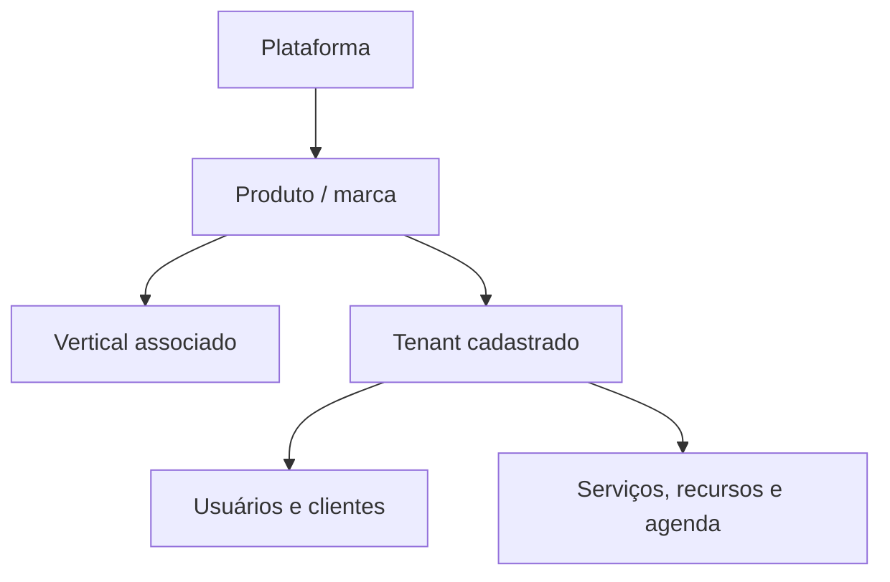

# Plataforma de agendamento: kernel compartilhado e produtos por nicho

**Status:** definição de produto com primeiro incremento funcional implementado

**Versão:** 0.2 — 25/09/2026

**Responsável pelo produto:** Eder

## 1. Visão e objetivo

Construir um SaaS de agendamento para pequenos negócios, com contratação e cadastro pelo próprio estabelecimento. A plataforma terá um **kernel técnico único**, administrado pelo proprietário do produto, e poderá sustentar várias ofertas comerciais especializadas. Cada oferta terá site, marca, linguagem e jornada adequados ao seu nicho.

O estabelecimento contrata diretamente o produto do seu segmento; **não escolhe nem configura um nicho**. A primeira oferta a validar é **Pet Shop / Banho e Tosa**. Salão e Barbearia são possibilidades de expansão, habilitadas pelo proprietário quando houver validação comercial.

**Hipótese de negócio:** um fluxo simples de cadastro, configuração e agendamento, apresentado na linguagem do segmento, pode gerar assinaturas recorrentes com baixa necessidade de implantação e suporte.

## 2. Decisões de produto

| Decisão               | Definição                                                                                                                 |
| --------------------- | ------------------------------------------------------------------------------------------------------------------------- |
| Modelo comercial      | Vários produtos/sites voltados a nichos, operados pela mesma plataforma.                                                  |
| Reuso                 | Uma base de código e um kernel compartilhado; diferenças explícitas por produto e módulos específicos quando necessárias. |
| Primeiro lançamento   | Pet Shop / Banho e Tosa, sem prontuário veterinário.                                                                      |
| Contratação           | Autocadastro, teste ou plano e ativação automática, conforme política comercial a definir.                                |
| Experiência           | Nome, textos, exemplos, formulários e apresentação comercial próprios de cada oferta.                                     |
| Configuração de nicho | Definida pela operação da plataforma a partir do produto de origem, nunca escolhida pelo cliente no cadastro.             |
| Expansão              | Abrir novos produtos após medir ativação, conversão, retenção e custo de atendimento do primeiro.                         |

Os nomes **PetFlow, BarberFlow e BeautyFlow** são apenas exemplos de trabalho; não representam marcas ou domínios registrados. Preços, prazo do teste e provedores externos também dependem de validação.

## 3. Conceitos e limites

| Conceito        | Significado                                                                | Exemplo                                                     |
| --------------- | -------------------------------------------------------------------------- | ----------------------------------------------------------- |
| Plataforma      | Operação técnica e administrativa de todos os produtos.                    | Painel do operador.                                         |
| Produto / marca | Oferta comercial com site, identidade, textos, plano e origem do cadastro. | Produto para banho e tosa.                                  |
| Vertical        | Regras e dados próprios de um segmento.                                    | Pet; Beleza; Barbearia.                                     |
| Tenant          | Estabelecimento contratante, com dados e assinatura próprios.              | Pet Shop do João.                                           |
| Unidade         | Local de atendimento de um tenant.                                         | Loja Centro. Na V1, apenas uma unidade por estabelecimento. |
| Usuário         | Pessoa que acessa o painel do estabelecimento.                             | Proprietário ou atendente.                                  |
| Cliente         | Pessoa atendida pelo estabelecimento.                                      | Tutora de um pet.                                           |
| Recurso         | Pessoa ou capacidade reservável para realizar o serviço.                   | Banhista, barbeiro ou profissional.                         |
| Serviço         | Oferta com duração e preço configurados pelo estabelecimento.              | Banho de porte médio.                                       |
| Agendamento     | Reserva de cliente, serviço, intervalo e recurso.                          | Banho de Thor, terça às 14h.                                |

**Produto, vertical e tenant são relações diferentes.** O produto de origem fixa o vertical do tenant durante o cadastro. O mesmo vertical pode, no futuro, sustentar mais de uma marca, sem duplicar a lógica de agenda. Mudanças de vertical para um tenant exigiriam migração explícita e ficam fora da V1.

Os **sites de venda** podem ter domínios e campanhas diferentes. O **painel operacional** pode usar a mesma aplicação com tema, textos e módulos determinados pelo produto do tenant. Isso evita manter três aplicações quase iguais. A hospedagem e os domínios concretos serão escolhidos mais adiante.

## 4. Escopo funcional do kernel V1

### 4.1 Conta, isolamento e operação

- Autocadastro de estabelecimento e criação de tenant vinculados ao produto de origem.
- Um administrador inicial; login e recuperação de acesso.
- Usuários do estabelecimento com papéis simples: administrador e equipe. Permissões detalhadas apenas quando uma necessidade real surgir.
- Configuração de nome, contato, fuso horário, endereço e horários de funcionamento.
- Separação dos dados de cada tenant em toda consulta e gravação, incluindo arquivos, relatórios e rotas públicas.
- Visão administrativa mínima para o operador acompanhar cadastros, situação dos planos e ocorrências de suporte, sem editar dados de clientes sem necessidade operacional.

### 4.2 Cadastro e agenda

- Clientes, serviços, duração, preço e recursos profissionais.
- Disponibilidade semanal do recurso, bloqueios pontuais e duração do serviço.
- Agendamento interno: criar, confirmar, reagendar, cancelar e concluir.
- Visões diária e semanal; busca por cliente, período e recurso.
- Regra de conflito: impedir sobreposição de reservas ativas para o mesmo recurso. A gravação deve verificar conflitos de forma segura sob concorrência, não apenas na interface.
- Horários apresentados no fuso do estabelecimento e armazenados de forma consistente; política para horários de verão e alteração de fuso antes do desenvolvimento.
- Registro mínimo de criação, alteração de horário e cancelamento para suporte e rastreabilidade.

**Modelo V1 do agendamento:** um serviço, um cliente e um recurso principal por reserva. Se um banho exigir simultaneamente banhista e box, ou vários serviços na mesma visita, isso será uma evolução explícita, após entrevistar estabelecimentos. O conceito de recurso permanece genérico, mas a V1 não precisa implementar um motor universal de alocação.

### 4.3 Página pública

- Link público individual por estabelecimento, com nome, serviços permitidos e horários disponíveis.
- Cliente solicita um horário e informa dados mínimos de contato; no produto Pet, seleciona ou informa o pet.
- O estabelecimento define se o agendamento entra confirmado ou pendente de aprovação.
- Proteções básicas contra solicitações abusivas e validação de disponibilidade novamente na confirmação.

### 4.4 Cobrança e métricas

- Estado da assinatura por tenant: teste, ativa, vencida, cancelada; limites por plano somente onde forem necessários.
- Integração de cobrança e liberação automática como etapa anterior à venda paga, com conciliação por eventos idempotentes do provedor escolhido.
- Indicadores simples: agendamentos por período, cancelamentos, serviços mais agendados e valor **previsto** dos serviços concluídos. Valor previsto não equivale a receita recebida.
- Recebimentos, caixa e repasses ficam fora do primeiro corte, salvo validação de que são decisivos para fechar as primeiras vendas.

## 5. Vertical Pet e próximos produtos

### Pet Shop / Banho e Tosa — primeiro produto

- Cadastro de pets ligado ao cliente/tutor: nome, espécie, porte, raça opcional, observações e foto opcional.
- Agendamento ligado a um pet por vínculo próprio do módulo Pet; o kernel guarda cliente, serviço, recurso e horário, sem coluna `pet_id` na tabela central.
- Linguagem do painel e da página pública: tutor, pet, banho, tosa e profissional.
- Histórico de agendamentos do pet. Dados de saúde sensíveis, prontuário e prescrição fora do escopo.

### Salão e Barbearia — expansão planejada

Podem compartilhar o agendamento, os cadastros e a assinatura. Alteram identidade, textos, serviços iniciais e eventuais regras comprovadamente necessárias. A expansão depende de entrevistas e validação de aquisição; **não pressupõe** que bastará trocar o logo.

| Elemento          | Pet Shop           | Salão           | Barbearia       |
| ----------------- | ------------------ | --------------- | --------------- |
| Pessoa atendida   | Tutor / cliente    | Cliente         | Cliente         |
| Objeto adicional  | Pet                | Nenhum previsto | Nenhum previsto |
| Recurso principal | Banhista / tosador | Profissional    | Barbeiro        |
| Serviço exemplo   | Banho e tosa       | Corte / escova  | Corte / barba   |

Clínicas médicas ou veterinárias, oficinas e outros nichos com prontuário, fiscalidade ou alocação complexa **não entram automaticamente** no mesmo produto. São oportunidades a estudar separadamente.

## 6. Estrutura lógica inicial

Os nomes abaixo são conceituais, não uma migração SQL definitiva.

| Área                 | Entidades candidatas                                                                             | Responsabilidade                                  |
| -------------------- | ------------------------------------------------------------------------------------------------ | ------------------------------------------------- |
| Catálogo de produtos | `brand`, `vertical`, `brand_vertical`                                                            | Origem do cadastro, tema e segmento operado.      |
| Conta e acesso       | `tenant`, `user`, `membership`                                                                   | Estabelecimento e vínculo de pessoas autorizadas. |
| Agenda               | `customer`, `resource`, `service`, `availability_rule`, `time_block`, `booking`, `booking_event` | Cadastro, disponibilidade e reservas.             |
| Vertical Pet         | `pet`, `pet_booking`                                                                             | Dados do animal e vínculo ao agendamento.         |
| Comercial            | `plan`, `subscription`, `billing_event`                                                          | Estado contratual e eventos da cobrança.          |

As entidades de negócio pertencentes a um estabelecimento devem carregar `tenant_id`; vínculos e políticas de acesso devem impedir referências entre tenants. `brand_id` e `vertical_id` são definidos no cadastro pelo backend a partir de uma origem confiável, e não aceitos livremente do formulário. O operador deve poder suspender um tenant; retenção, exclusão e exportação de dados pessoais terão regras definidas antes do lançamento.

**Não criar na V1:** motor de entidades customizadas, formulários dinâmicos, workflow configurável, múltiplas marcas dentro de um tenant, reservas com várias pessoas e equipamentos, marketplace entre estabelecimentos ou infraestrutura separada por vertical.

## 7. Fluxos principais

### Autocadastro

1. Visitante acessa o site de um produto e escolhe testar ou contratar.
2. Backend identifica o produto pela rota/domínio configurado, verifica se ele está habilitado e atribui o vertical correspondente.
3. Pessoa informa estabelecimento, e-mail e senha; confirma acesso conforme o método de autenticação escolhido.
4. Criação atômica ou recuperável de tenant, administrador e período de teste/plano, sem duplicar conta em reenvios.
5. Assistente curto configura serviços, profissionais e horários. O estabelecimento recebe seu link público.
6. A plataforma mede cadastro concluído e primeiro agendamento como eventos distintos de ativação.

### Agendamento público

1. Cliente escolhe serviço, pet quando aplicável, data e horário.
2. Sistema calcula opções conforme funcionamento, duração, bloqueios e reservas existentes.
3. Ao confirmar, valida novamente a disponibilidade e grava a reserva protegida contra conflito concorrente.
4. Exibe o estado real da solicitação; o estabelecimento visualiza e confirma quando sua política exigir.
5. Notificação por e-mail ou WhatsApp somente quando o canal e seus custos estiverem definidos e consentimentos/opt-out implementados.

## 8. Plano de entrega e validação

| Etapa            | Entrega verificável                                                                | Critério de saída                                                      |
| ---------------- | ---------------------------------------------------------------------------------- | ---------------------------------------------------------------------- |
| 0. Descoberta    | Conversas com 5–10 operações de banho e tosa; landing page e proposta de preço.    | Dores, fluxo e disposição de pagar registrados.                        |
| 1. Base          | Produto de origem, tenant, login, onboarding, clientes, pets, serviços e recursos. | Uma conta nova consegue configurar o estabelecimento sem intervenção.  |
| 2. Agenda        | Disponibilidade, bloqueios, agenda interna e prevenção de conflitos.               | Dois pedidos simultâneos não ocupam o mesmo recurso/horário.           |
| 3. Aquisição     | Página pública, agendamento e métricas de ativação.                                | Cliente final consegue reservar; operação consegue atender e concluir. |
| 4. Cobrança      | Planos, teste, pagamento e eventos de assinatura.                                  | Ativação, renovação, inadimplência e cancelamento reproduzíveis.       |
| 5. Segundo nicho | Site e experiência próprios, com diferenças necessárias implementadas.             | Novo produto usa o kernel sem duplicar lógica de agendamento.          |

As etapas são **ordem de trabalho**, não promessa de prazo. Antes de investir em anúncios, definir instrumentação para visitas, cadastros, primeira reserva, início de pagamento, conversão paga, cancelamento e tickets de suporte. Receita mensal é `assinantes ativos × ticket médio`, antes de taxas, impostos, aquisição, hospedagem e suporte; números de assinantes são cenários, não previsão.

## 9. Diretrizes técnicas definidas no incremento 0.1

- Aplicação web responsiva, adequada ao celular da operação; aplicativo nativo apenas se houver demanda comprovada.
- Uma base de código para o painel, com configuração de produto/vertical controlada pelo servidor; sites comerciais podem compartilhar componentes sem perder posicionamento próprio.
- API e persistência com testes de isolamento por tenant e de concorrência do agendamento.
- Stack escolhida: **TypeScript, React/Vite, Node.js/Fastify e PostgreSQL**. O ambiente local usa PGlite quando não há PostgreSQL externo. Autenticação por sessão no backend. Os provedores de hospedagem, cobrança e mensageria continuam em aberto.
- Segredos e credenciais apenas no servidor; backups, logs de falha e monitoramento mínimo antes da primeira venda.
- Tratar dados de contato e fotos com finalidade definida, acesso restrito, política de retenção e meios para atender solicitações de titulares.

## 10. Questões abertas para a próxima revisão

1. Qual dor o primeiro cliente pagaria para resolver: organização interna, agendamento público, redução de faltas ou controle de recebimentos?
2. Agendamento público entra confirmado ou depende de aceite? Há diferença por serviço?
3. Como representar serviços que exigem vários recursos ou etapas sem complicar a V1?
4. Qual política de teste, preço, limites e forma de cobrança passa no teste comercial?
5. Qual canal de lembretes tem custo e adesão compatíveis com o ticket? WhatsApp automatizado depende de integração, templates e custos do provedor.
6. Qual política de privacidade, retenção e exportação se aplica aos dados de clientes e pets?
7. Qual nome/domínio de cada produto será adquirido após verificar disponibilidade e possíveis conflitos de marca?

## 11. Critério para alterar o kernel

Uma capacidade entra no kernel quando atende ao modelo comum de pelo menos dois produtos **ou** quando pertence inequivocamente à infraestrutura compartilhada (identidade, isolamento, assinatura, agenda básica). Regras de um nicho ficam no módulo vertical. Mudanças devem preservar contratos claros entre as duas partes e ser justificadas por uso observado; o objetivo é reutilizar o que existe, sem construir um sistema genérico para qualquer negócio.

## 12. Estado real da primeira implementação

O repositório agora contém uma aplicação executável. O primeiro incremento implementa cadastro e login por marca, tenant isolado, cadastros de clientes/serviços/profissionais, pets em módulo separado, disponibilidade semanal, bloqueios, agenda diária/semanal, criação e remarcação, cancelamento e conclusão. Inclui dashboard e trial informativo de 14 dias.

As seções anteriores definem a **visão do produto**, não afirmam que todo o MVP foi concluído. Página pública de reservas, sites comerciais completos, recuperação de senha, equipe e permissões na interface, cobrança, recebimentos, WhatsApp, recorrência e painel do operador ainda são backlog.

| Camada       | Decisão implementada                                                                             |
| ------------ | ------------------------------------------------------------------------------------------------ |
| Plataforma   | Monólito modular, uma API e um banco compartilhados.                                             |
| Vertical     | Registro de regras específicas; Pet tem extensão real de agendamento.                            |
| Marca        | PetFlow, BarberFlow, BeautyFlow e EsteticaFlow como exemplos configurados no servidor.           |
| Tenant       | Um estabelecimento, uma marca e um administrador inicial; sem troca de nicho no cadastro.        |
| Interface    | Shell compartilhado com linguagem e tema por marca; nenhuma seleção de nicho pelo usuário final. |
| Persistência | PostgreSQL externo ou PGlite local; constraints por tenant e migração versionada.                |

A primeira versão não cria tabelas vazias de pagamento e notificação para sugerir integrações prontas. Esses contratos serão adicionados com seus fluxos e testes quando forem implementados. A expansão comercial permanece controlada pelo proprietário da plataforma.

Consulte [README](README.md) para executar e [decisões técnicas](docs/decisoes-tecnicas.md) para regras, garantias e limites.
